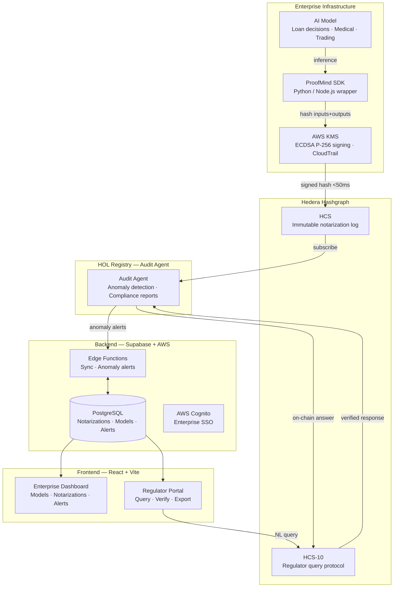
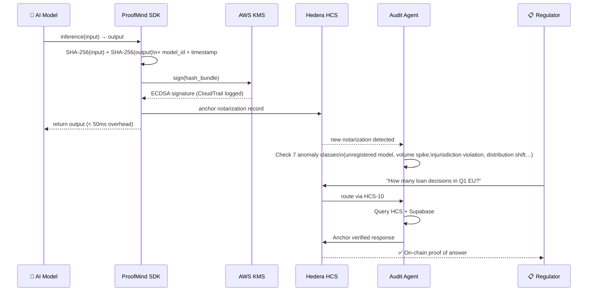

# ProofMind — Immutable AI Audit Infrastructure

**Cryptographic notarization for every AI decision. Anchored on Hedera. Queryable by regulators.**

> **Track:** Open Track | **Bounty:** AWS ($8,000)

ProofMind wraps enterprise AI models with a lightweight SDK that hashes every inference input and output, signs the hash via AWS KMS, and anchors it to Hedera HCS in real time. Enterprises keep all sensitive data private — only SHA-256 hashes leave their infrastructure. Regulators get a tamper-proof, independently verifiable audit trail they can query directly.

---

## The Problem

Regulators (EU AI Act, SEC, FDA, UK FCA) are demanding explainable, auditable AI decisions — but enterprises have no credible way to prove their AI behaved correctly after the fact. Logs can be deleted. Databases can be modified. Audit reports are self-certified. There is no tamper-proof, independently verifiable record of what an AI system actually decided.

---

## The Solution

ProofMind creates an immutable chain of custody for AI decisions:

1. Enterprise wraps AI inference with the ProofMind SDK (Python or Node.js decorator / context manager)
2. SDK hashes inputs + outputs with SHA-256, signs via AWS KMS (ECDSA P-256)
3. Hash + signature + model metadata anchored to Hedera HCS in < 50ms latency overhead
4. Audit Agent monitors the HCS topic for anomalies in real time
5. Regulators query the Audit Agent in natural language via HCS-10 and receive on-chain verified responses

**Zero sensitive data leaves the enterprise.** Only hashes. GDPR-safe by design.

---

## System Architecture



---

## Notarization Flow



---

## Tech Stack

| Layer | Technology |
|-------|-----------|
| Frontend | React 18 + Vite + TypeScript + Tailwind CSS + shadcn/ui |
| Backend | Supabase (PostgreSQL + Edge Functions + Realtime) |
| Blockchain | Hedera Hashgraph (HCS, HTS, Scheduled Transactions) |
| Key Management | AWS KMS (ECDSA P-256) + CloudTrail + Cognito SSO |
| SDK | Python & Node.js AI inference wrappers |
| Agent | HOL Registry — Audit Agent per enterprise |

## Hedera Services Used

| Service | Usage |
|---------|-------|
| **HCS** | Every notarization anchored as an immutable, ordered, timestamped record |
| **HCS-10** | Bidirectional regulator query protocol — natural language in, on-chain proof out |
| **HTS** | Enterprise compliance license tokens (non-transferable) |
| **Scheduled Transactions** | Automated weekly compliance report generation |
| **Mirror Node** | Historical notarization lookups, provenance chain retrieval |

---

## Quick Start

```bash
# Install dependencies
npm install

# Configure environment
cp .env.example .env
# Fill in Supabase credentials, AWS KMS key ARN, Hedera operator credentials

# Run the development server
npm run dev
```

---

## Documentation

- [Architecture Reference](./proofmind.md) — Full technical specification
- [Demo Setup](./DEMO_SETUP.md) — Step-by-step demo configuration
- [Demo Video Script](./DEMO_VIDEO_SCRIPT.md) — Walkthrough script

---

## License

MIT — ProofMind v1.0
